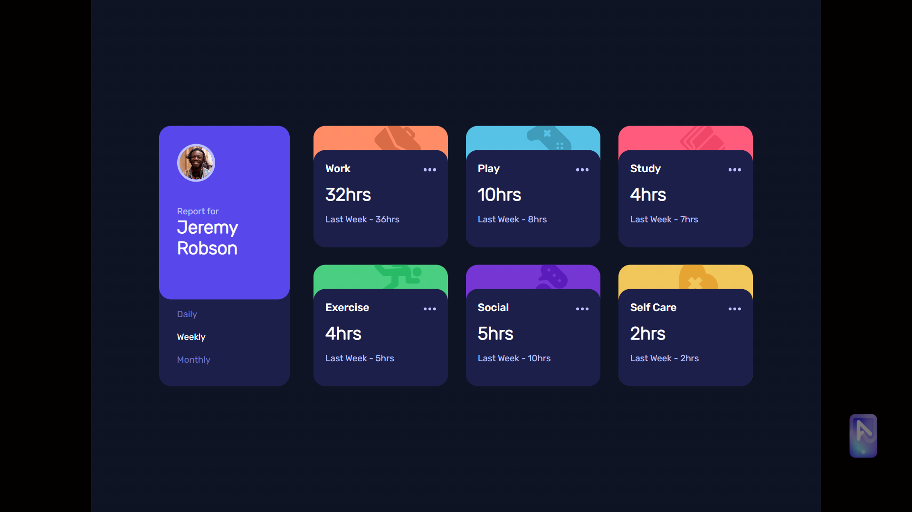
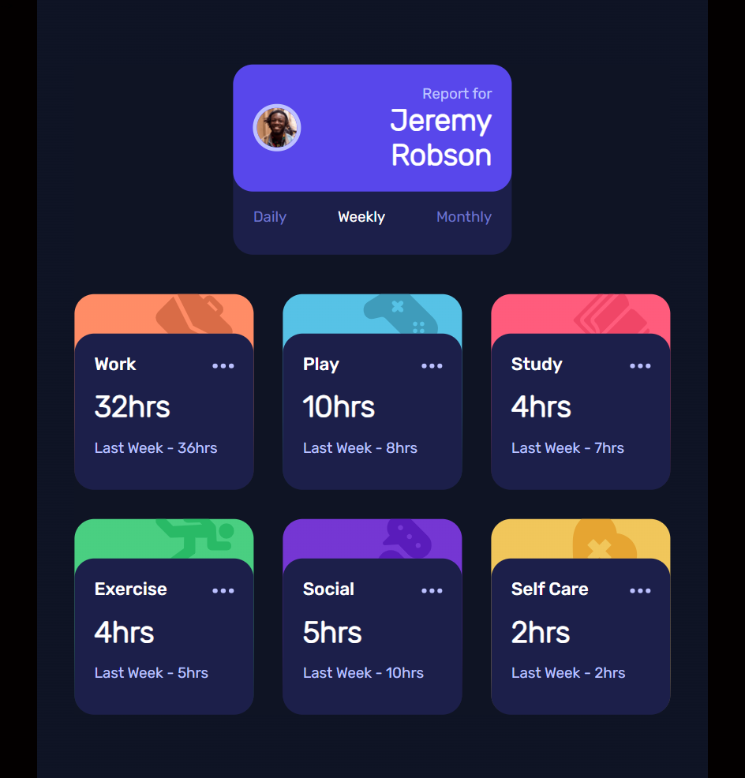
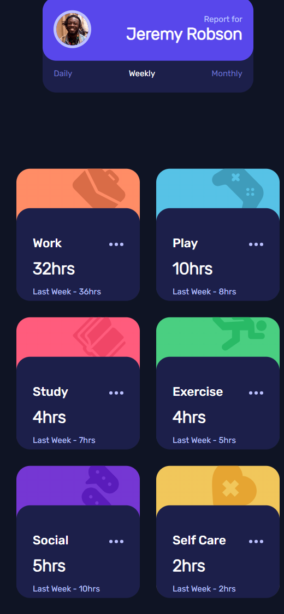
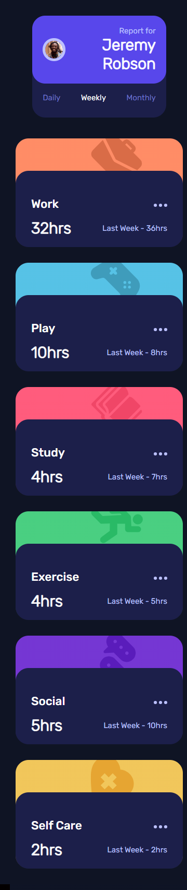

# Frontend Mentor - Time tracking dashboard solution

-   [ ]

## Table of contents

-   [Overview](#overview)
    -   [The challenge](#the-challenge)
    -   [Screenshot](#screenshot)
    -   [Links](#links)
-   [My process](#my-process)
    -   [Built with](#built-with)
    -   [What I learned](#what-i-learned)
    -   [Continued development](#continued-development)
    -   [Useful resources](#useful-resources)
-   [Author](#author)
-   [Acknowledgments](#acknowledgments)

**Note: Delete this note and update the table of contents based on what sections you keep.**

## Overview

### The challenge

Users should be able to:

-   View the optimal layout for the site depending on their device's screen size
-   See hover states for all interactive elements on the page
-   Switch between viewing Daily, Weekly, and Monthly stats

### Screenshot

### Links

-   Solution URL: [https://github.com/Hargent/time-tracking-dashboard](https://github.com/Hargent/time-tracking-dashboard)
-   Live Site URL: [https://time-tracking-dashboard-hargent.netlify.app/](https://time-tracking-dashboard-hargent.netlify.app/)

## My process

### Built with

-   JSX markup
-   CSS custom properties
-   Flexbox
-   CSS Grid
-   CSS Gradients
-   Desktop-first workflow
-   [React](https://reactjs.org/) - JS library
-   [SCSS]() - CSS framework

### What I learned

-   Use of css Grid and Flexbox
-   The use of props in react

### Continued development

-   Use of API's
-   Syncing frontend rendering with backend data of an app
-   React frameworks e.g [Next js]()

### Useful resources

-   [SASS](https://www.example.com) - This helped me in the implementation and use of sass variables.
-   [React UI](https://react.dev/learn/describing-the-ui) - This is an amazing article which helped me in structuring my app UI using react js library
-   [CSS Grids](https://css-tricks.com/snippets/css/complete-guide-grid/) - This article really helped me in refreshing my knowledge about css grid flow.

## Author

-   Website - **Timileyin David Yemisi**
-   Frontend Mentor - [@Hargent](https://www.frontendmentor.io/profile/Hargent)
-   Twitter - [@_Hargent_](https://www.twitter.com/_Hargent_ "_Hargent_")
-   LinkdIn - [Timileyin (David) Yemisi](linkedin.com/in/timileyin-yemisi-23219422b)
-   Email - yemisi3385@gmail.com
-   Github - @[Hargent](https://github.com/Hargent)

## Acknowledgments

In sincere appreciation, I extend my heartfelt gratitude to my esteemed mentor, [Abdullahi Hussein]() for his invaluable guidance, unwavering support, and inspiring leadership throughout this project.
